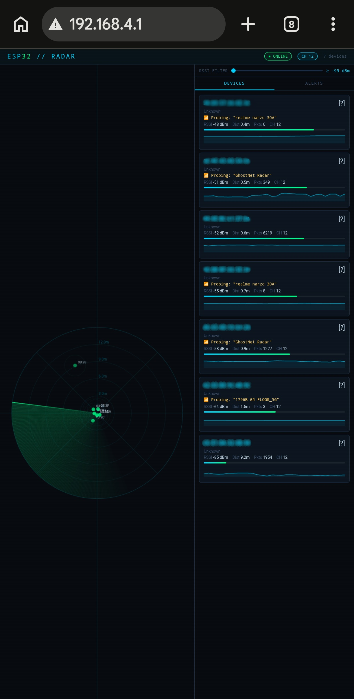
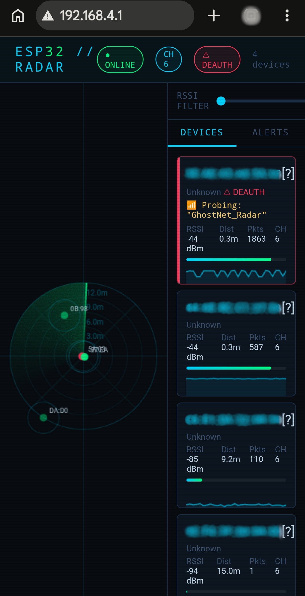

# GhostNet_Sniffer

[](https://www.espressif.com/en/products/socs/esp32)
[](https://www.arduino.cc/)
[](https://arduinojson.org/)
[](#-license--copyright)




**Passive Wi-Fi sensing radar using an ESP32 in promiscuous mode.**  
Detects nearby 2.4 GHz Wi-Fi devices, estimates their distance, and visualizes them in real time on a web-based radar dashboard — no external network required.

> **Passive Wi-Fi radar that haunts the airwaves — detect hidden devices and motion using just an ESP32.**

---

## 📋 Table of Contents

- [Overview](#-overview)
- [Features](#-features)
- [Hardware Requirements](#-hardware-requirements)
- [Software & Libraries](#-software--libraries)
- [Project Structure](#-project-structure)
- [Getting Started](#-getting-started)
- [Web Interface](#-web-interface)
- [How It Works](#-how-it-works)
- [License & Copyright](#-license--copyright)
- [Acknowledgements](#-acknowledgements)
- [Contact](#-contact)

---

## 📡 Overview

Traditional radar emits signals and listens for echoes. GhostNet_Sniffer flips the concept: it **passively listens** to existing Wi-Fi traffic on the 2.4 GHz band. By analyzing the **Received Signal Strength Indicator (RSSI)** of captured 802.11 packets, it can:

- Detect the presence of nearby Wi-Fi devices (phones, laptops, IoT gadgets)
- Estimate their distance using a Log-Distance Path Loss model
- Capture probe requests and reveal SSIDs devices are searching for
- Detect deauthentication attacks in real time
- Display everything on a live tactical radar interface

The ESP32 acts as a **standalone access point** hosting the dashboard over WebSocket — no router, no internet, no cloud.

---

## ✨ Features

| Feature | Description |
|---|---|
| **Passive sniffing** | Captures all 802.11 frames in promiscuous mode without associating to any network |
| **Channel hopping** | Automatically cycles channels 1–13 every 150 ms to catch devices on any channel |
| **MAC OUI fingerprinting** | Identifies device manufacturer (Apple, Samsung, Cisco, Xiaomi, TP-Link, etc.) from the first 3 bytes of the MAC address |
| **RSSI history graph** | Per-device sparkline showing signal strength over the last 30 packets |
| **Probe request capture** | Extracts and displays the SSIDs that devices are actively searching for |
| **Deauth detection** | Flags 802.11 deauthentication frames with a visual alert and per-device marker |
| **RSSI threshold filter** | Live slider in the UI to filter out weak/distant devices |
| **Alert log** | Ring buffer of the last 10 events (new device, deauth) shown in a dedicated tab |
| **LRU eviction** | When the device table is full, the least-recently-seen device is replaced |
| **Thread-safe** | FreeRTOS mutex guards the device table between the sniffer task (Core 0) and the web task (Core 1) |
| **Non-blocking loop** | All timers use `millis()` — no `delay()` blocking WebSocket cleanup |
| **Serial event log** | Every new device, deauth event, and pruned device is printed to Serial at 115200 baud |
| **Auto-reconnect UI** | Browser WebSocket reconnects automatically if the ESP32 reboots |

---

## 🧰 Hardware Requirements

| Component | Notes |
|---|---|
| **ESP32 Development Board** | Any ESP32 variant with 2.4 GHz Wi-Fi (ESP32-D0WD, WROOM-32, etc.) |
| **USB Cable** | Data-sync capable (not charge-only) |
| **Power supply** | USB port or 5V adapter |

No additional sensors, antennas, or transceivers required — the built-in Wi-Fi radio does everything.

---

## 📦 Software & Libraries

Install the following via **Sketch → Include Library → Manage Libraries…**:

| Library | Author | Minimum Version |
|---|---|---|
| `AsyncTCP` | me-no-dev | 1.1.1 |
| `ESPAsyncWebServer` | me-no-dev | 1.2.3 |
| `ArduinoJson` | Benoit Blanchon | **7.x** |

> ⚠️ **ArduinoJson v7 required.** The code uses `JsonDocument` (v7 API). The old `DynamicJsonDocument` from v6 is not compatible.

**Platform:** Arduino IDE 2.x with Espressif ESP32 core **2.0.14 or newer**.

---

## 📁 Project Structure

```
GhostNet_Sniffer/
├── esp32_wifi_radar.ino   # Main firmware — setup, loop, sniffer callback, JSON builder
└── html_page.h            # Embedded HTML/CSS/JS dashboard (included at compile time)
```

> The folder name **must match** the `.ino` filename exactly. Arduino IDE requires this.  
> To add `html_page.h` in Arduino IDE 2.x: click the **⋯ tab menu → New Tab**, name it `html_page.h`, and paste its contents.

---

## 🚀 Getting Started

### 1. Clone the repository

```bash
git clone https://github.com/ayuuXploits/GhostNet_Sniffer.git
cd GhostNet_Sniffer
```

### 2. Open the sketch

Open `esp32_wifi_radar.ino` in Arduino IDE. The `html_page.h` tab should appear automatically alongside it.

### 3. (Optional) Adjust configuration

Near the top of `esp32_wifi_radar.ino`:

```cpp
const char*    AP_SSID        = "GhostNet_Radar";  // AP name clients connect to
const char*    AP_PASS        = "radar12345";       // AP password
const uint8_t  HOP_MIN_CH     = 1;                 // First channel to hop
const uint8_t  HOP_MAX_CH     = 13;                // Last channel to hop
const uint32_t HOP_DWELL_MS   = 150;               // Milliseconds per channel
const float    TX_POWER_REF   = -59.0f;            // RSSI at 1 m — calibrate for your environment
const float    PATH_LOSS_N    = 2.7f;              // Path-loss exponent (2.0 = free space, 2.7 = indoors)
const float    MAX_DISTANCE   = 15.0f;             // Distance cap in metres
const uint32_t DEVICE_TIMEOUT_MS = 30000;          // Remove device after 30 s of silence
```

### 4. Select board and port

```
Tools → Board → ESP32 Dev Module
Tools → Port → (your ESP32's COM / tty port)
```

### 5. Upload

Click **Upload**. Watch the Serial Monitor (115200 baud) for boot messages:

```
=== ESP32 Wi-Fi Radar BOOT ===
[WiFi] AP started  SSID=GhostNet_Radar  IP=192.168.4.1
[WiFi] Promiscuous mode ON
[HTTP] Server started on port 80
```

### 6. Open the dashboard

Connect your phone or laptop to the Wi-Fi network:

```
SSID:     GhostNet_Radar
Password: radar12345
```

Then open a browser and navigate to:

```
http://192.168.4.1
```

The radar loads instantly. Dots appear as devices are detected. Walk around — distances update in real time.

---

## 🖥️ Web Interface

| Element | Description |
|---|---|
| **Radar canvas** | Animated green sweep with range rings (3 m / 6 m / 9 m / 12 m). Each dot is a detected device; distance from center = estimated distance. Deauth sources glow red. |
| **Channel pill** | Shows the current hopping channel, updating every 150 ms |
| **Deauth alert** | Blinking red pill appears when any deauthentication frame is detected |
| **Devices tab** | Live-sorted device cards showing vendor, MAC, RSSI, distance, packet count, channel, probed SSID (if any), signal bar, and RSSI sparkline |
| **Alerts tab** | Timestamped log of all new-device and deauth events since page load |
| **RSSI filter slider** | Drag to hide devices below a chosen signal threshold — changes take effect on the ESP32 immediately via WebSocket |

---

## ⚙️ How It Works

### Promiscuous mode

The ESP32's Wi-Fi controller is put into promiscuous mode, capturing every 802.11 frame on the current channel regardless of destination MAC. A plain C callback (`IRAM_ATTR`) is registered — this is critical; a C++ lambda cannot be passed to the Espressif SDK's callback registration and will cause a crash or silent failure.

### Thread safety

The sniffer callback runs on **Core 0** (Wi-Fi task). The web server and JSON serializer run on **Core 1** (Arduino loop task). A FreeRTOS mutex (`SemaphoreHandle_t`) serializes all access to the device table. The callback uses the ISR-safe `xSemaphoreTakeFromISR` / `xSemaphoreGiveFromISR` variants to avoid blocking the radio.

### Channel hopping

Every `HOP_DWELL_MS` milliseconds, `loop()` calls `esp_wifi_set_channel()` to advance to the next channel (1→2→…→13→1). This lets the sniffer catch devices on any 2.4 GHz channel at the cost of slightly lower per-channel resolution.

### Distance estimation

Distance is computed using the **Log-Distance Path Loss** model:

```
distance (m) = 10 ^ ( (TX_POWER_REF - RSSI) / (10 × n) )
```

Where `TX_POWER_REF` is the expected RSSI at 1 metre (calibrate by holding a known device 1 m from the ESP32 and reading its RSSI), and `n` is the path-loss exponent (2.0 for free space, ~2.7 for a typical indoor environment).

### Angle estimation

The display angle is derived from an **FNV-1a hash** of the MAC address, giving each device a stable, uniformly distributed position around the radar. This is a visualization aid only — real angle-of-arrival requires multiple antennas or CSI data, which this hardware does not provide.

### Probe request capture

Management frames with subtype `0x04` (Probe Request) contain an Information Element with the SSID the device is searching for. The sniffer parses this IE and stores it per device, revealing network names even when no AP is present.

### Deauth detection

Management frames with subtype `0x0C` (Deauthentication) are flagged. The source MAC is marked in the device table, a red alert is pushed to the alert ring buffer, and the device card turns red in the UI.

---

## 📜 License & Copyright

Copyright © 2026 [ayuuXploits]. All rights reserved.

This software and its associated documentation are proprietary to the author. No part of this software may be reproduced, distributed, or transmitted in any form or by any means without the prior written permission of the author, except for brief quotations in critical reviews as permitted by copyright law.

For permission inquiries, please open an issue on this repository or contact the maintainer directly.

---

## 🤝 Acknowledgements

- **Espressif Systems** — ESP32 promiscuous mode API and IDF documentation
- **me-no-dev** — AsyncTCP and ESPAsyncWebServer libraries
- **Benoit Blanchon** — ArduinoJson
- Radar UI design inspired by classic PPI (Plan Position Indicator) displays

---

## 📬 Contact

| | |
|---|---|
| **Maintainer** | [ayuuXploits] |
| **Repository** | https://github.com/ayuuXploits/GhostNet_Sniffer |
| **Issues** | Open a GitHub issue for bug reports or feature requests |
