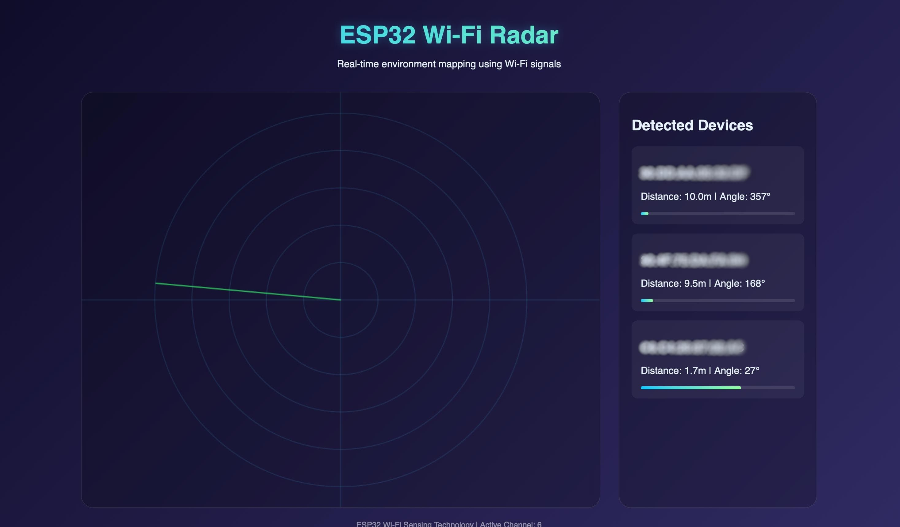
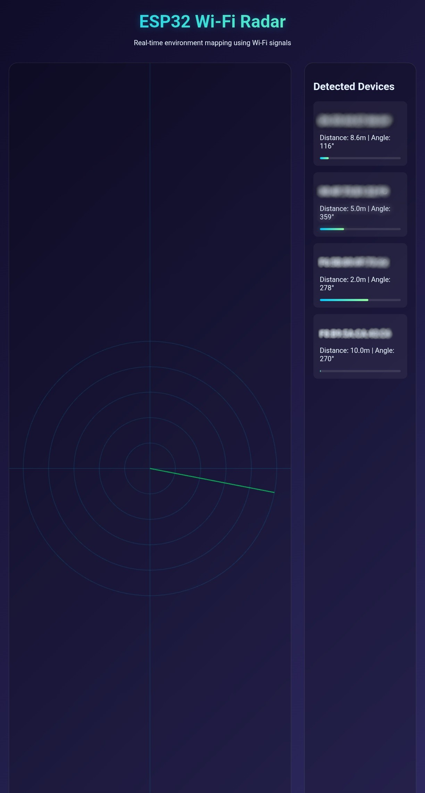

# GhostNet_Sniffer

[](https://www.espressif.com/en/products/socs/esp32)
[](https://www.arduino.cc/)


**Passive Wi‑Fi sensing radar using an ESP32 in promiscuous mode.**  
Detects nearby 2.4 GHz Wi‑Fi devices, estimates their distance, and visualizes them in real time on a web‑based radar dashboard.

**Passive Wi‑Fi radar that haunts the airwaves – detect hidden devices and motion using just an ESP32.**


---

## 📡 Overview

Traditional radar emits signals and listens for echoes. This project flips the concept: it passively listens to existing Wi‑Fi traffic from any router or device. By analyzing the **Received Signal Strength Indicator (RSSI)** of captured packets, it can:

- Detect the presence of Wi‑Fi devices (phones, laptops, IoT gadgets)
- Estimate their distance (crude, but useful for motion detection)
- Display them on a live radar‑style interface

The ESP32 acts as a **standalone access point** hosting the radar dashboard, so no external network or internet connection is required.

---

## ✨ Features

- ✅ **Passive sniffing** – works with any 2.4 GHz router (no need to connect to it)
- ✅ **Real‑time web interface** – live radar sweep + device list, updated via WebSocket
- ✅ **Device fingerprinting** – MAC address, RSSI, estimated distance
- ✅ **Configurable channel** – set to match your router or scan manually
- ✅ **Zero external dependencies** – all processing on ESP32, HTML/JS embedded
- ✅ **Lightweight** – uses ~77% of flash, runs on any ESP32 dev board

---

## 🧰 Hardware Requirements

| Component | Notes |
|-----------|-------|
| **ESP32 Development Board** | Any variant with 2.4 GHz Wi‑Fi (ESP32‑D0WD, ESP32‑S3, etc.) |
| **USB Cable** | Data‑sync capable (not charge‑only) |
| **Power supply** | USB port (computer or 5V adapter) |

No additional sensors, antennas, or transceivers required – the built‑in Wi‑Fi radio does all the work.

---

## 📦 Software & Libraries

Install the following libraries via the **Arduino Library Manager** (Sketch → Include Library → Manage Libraries…):

| Library | Author | Minimum Version |
|---------|--------|----------------|
| `AsyncTCP` | me‑no‑dev | 1.1.1 |
| `ESPAsyncWebServer` | me‑no‑dev | 1.2.3 |
| `ArduinoJson` | Benoit Blanchon | 6.19.4 |

**Platform**: Arduino IDE 2.x or 1.8.x with ESP32 board support (Espressif core 2.0.14+).

---

## 🚀 Getting Started

### 1. Clone the repository

```bash
git clone https://github.com/ayuuXploits/GhostNet_Sniffer.git
cd GhostNet_Sniffer
```
### 2. Open the sketch in Arduino IDE
```
Open GhostNet_Sniffer.ino.
```
### 3. Configure the Wi‑Fi channel
```
** Find which 2.4 GHz channel your router is using (e.g., with a Wi‑Fi analyzer app).
Modify this line near the top of the sketch:

cpp
const int channel = 6;   // Change to your router's channel (1-11)

```
### 4. Select board and port
```
Tools → Board → ESP32 Dev Module (or your specific model)
Tools → Port → select your ESP32’s serial port
```
### 5. Upload
```
Click the Upload button. Wait for Done uploading in the console.
```
### 6. Connect to the radar

**On your phone or laptop, join the Wi‑Fi network:**

```
SSID: GhostNet_Sniffer
Password: radar12345
Open a web browser and go to:
http://192.168.4.1
The radar interface will load. Walk around – devices will appear as moving dots.
```
---
## 🖥️ Web Interface

**Element	Description**

Radar canvas	Animated sweep with concentric circles. Each dot represents a detected device; its distance from center = estimated distance in meters (capped at 10 m).
Device list	Shows MAC address, distance (meters), angle (pseudo‑angle from MAC hash), and a signal strength bar.
Real‑time updates	Data refreshes every second via WebSocket.
(Screenshot placeholder)

## ⚙️ Configuration Options

Inside GhostNet_Sniffer.ino, you can adjust:
```
cpp
const char* ssid = "GhostNet_Sniffer";    // AP name
const char* password = "radar12345";      // AP password
const int channel = 6;                    // Sniffer channel (1-11)
const int MAX_DISTANCE = 10;              // Maximum display distance (meters)
Change AP credentials – customise SSID/password if desired.
Increase range – raise MAX_DISTANCE, but note RSSI‑to‑distance becomes unreliable beyond ~15 m.
Update frequency – change delay(1000); in loop() (lower = faster updates, but more overhead).
```
___
## 🧪 How It Works (Technical Summary)

**Promiscuous mode** – The ESP32’s Wi‑Fi controller captures every 802.11 packet in the air on the chosen channel, regardless of destination.
**Packet parsing** – Extracts the transmitter MAC address (addr2) and RSSI from the radio control header.
**Device tracking** – A simple database stores each MAC, its latest RSSI, and a timestamp. Devices unseen for 10 seconds are dropped from the display.
**Distance estimation** – Uses a free‑space path loss model:
distance = exp(( -RSSI - 45 ) / 20). This is a rough approximation – walls and interference affect accuracy.
**Angle simulation** – The visual angle is a hash of the MAC address, so each device appears at a stable (but arbitrary) angle. Real angle‑of‑arrival would require multiple antennas or CSI data.
### Web dashboard – The ESP32 runs an asynchronous web server + WebSocket. Every second it serialises the device list to JSON and pushes it to all connected clients. The browser draws the radar.
___


## 📜 License & Copyright

Copyright © 2026 [ayuuXploits]. All rights reserved.

This software is provided “as is”, without warranty of any kind, express or implied.
You may not copy, modify, sublicense, or distribute this software without explicit written permission from the author.

For permission inquiries, please contact the author.

## 🤝 Acknowledgements

ESP32 promiscuous mode API – Espressif Systems
AsyncTCP & ESPAsyncWebServer – me‑no‑dev
Radar UI design inspired by classic PPI displays
📬 Contact

## For support, questions, or licensing inquiries, please open an issue on this repository (if public) or contact the maintainer directly.
```
Maintainer:[ayuuXploits]
Project Repository: https://github.com/ayuuXploits/GhostNet_Sniffer
```

